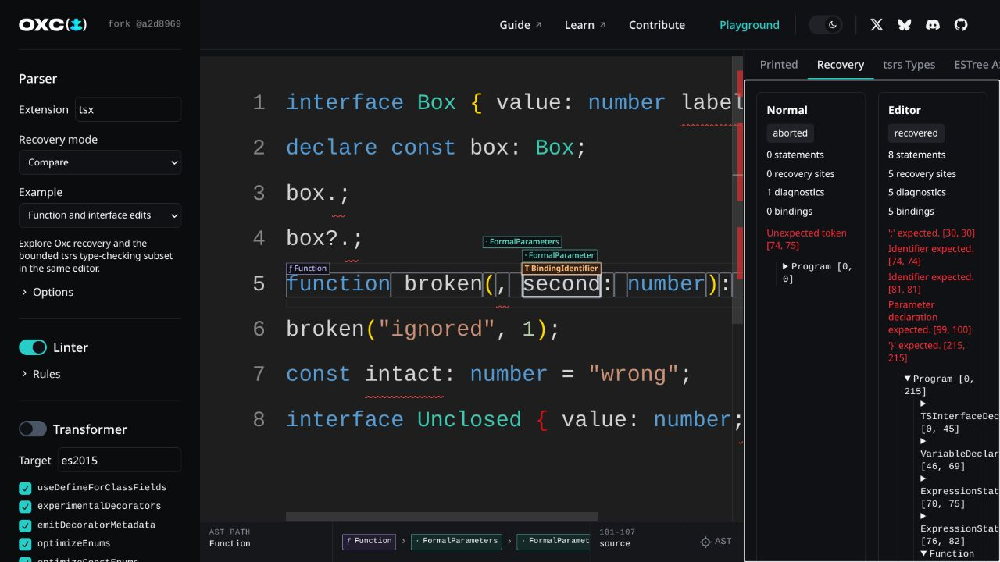

# Oxc Playground

[playground.oxc.rs](https://playground.oxc.rs)

## Inline AST lens

The main editor projects the caret's AST path directly onto the source. Compact node labels use
vertical lanes above the affected spans, nested frames show exact source ranges, and the fixed
breadcrumb preserves the complete logical path without moving the code.

## Development

Assuming the oxc repository is in `../oxc`:

- in a different terminal and in the `oxc` repository:
  - `just install-wasm`
  - `just watch-playground`
- in this repo: `pnpm run dev`

# [Sponsored By](https://oxc.rs/sponsor)

  

